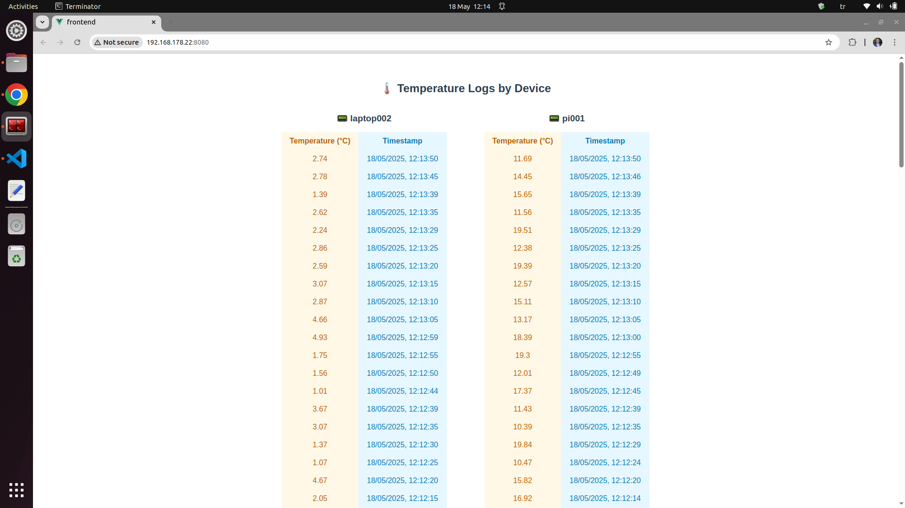
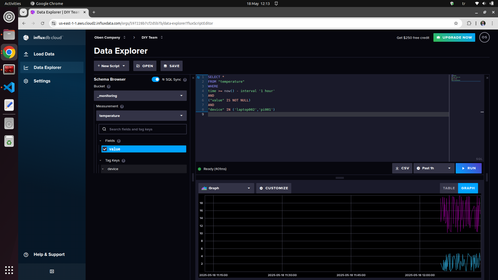

# 🌐 IOT Project




## 🔄 Workflow

1. 🐍 **Topic Publisher** (Raspberry Pi - Python)  
   ⬇  
2. 🛰️ **MQTT Broker**  
   ⬇  
3. 📥 **Topic Subscriber & InfluxDB Writer** (Python)  
   ⬇  
4. 🧠 **Backend** (Python - FastAPI)  
   ⬇  
5. 🎨 **Frontend** (Vue.js)


## ⚙️ Installations
### 🛰️ Mosquitto
```
sudo apt update
sudo apt install mosquitto mosquitto-clients
sudo systemctl start mosquitto
sudo systemctl enable mosquitto
sudo systemctl status mosquitto
```

### 🐍 Python
```
cd iot_project/
pip3 install -r requirements.txt
```

### 🎨 Frontend
```
cd iot_project/frontend/
npm i
```

## 🚀 Run the Project
### 🐍 Python Services
Don't forget to customize the InfluxDB settings in *mqtt_subscriber.py* and *backend.py* respect to your account.
```
cd iot_project/scripts/
python3 mqtt_publisher.py
python3 mqtt_publisher_pi.py 
python3 mqtt_subscriber.py
uvicorn backend:app --reload --host 0.0.0.0 --port 8000
```

### 🎨 Launch Frontend
```
cd iot_project/frontend/
npm run serve
```

## 📊 InfluxDB Data Monitoring

